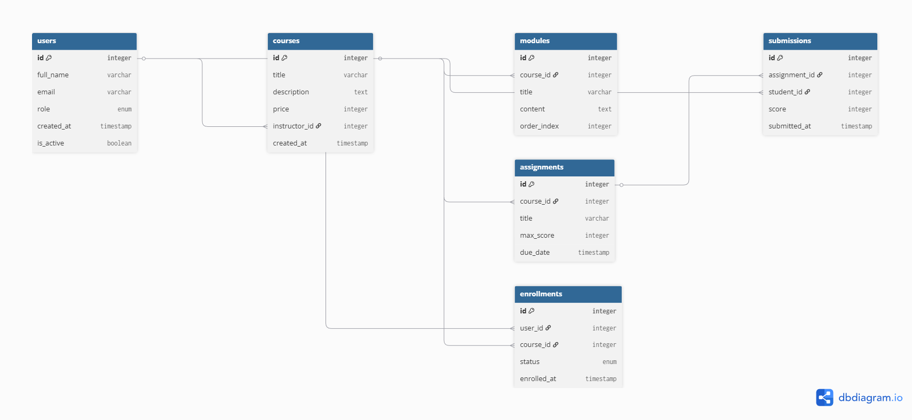

# Документація схеми бази даних (Schema Documentation)

## 📊 Діаграма сутність-зв'язок (ERD)

Система побудована на реляційній моделі даних. Основні зв'язки:
* **Користувачі (Users)** створюють **Курси (Courses)** (як інструктори).
* **Користувачі** записуються на **Курси** через таблицю **Enrollments** (багато-до-багатьох).
* **Курс** складається з **Модулів (Modules)** та **Завдань (Assignments)** (один-до-багатьох).
* **Студенти** здають рішення до завдань у таблицю **Submissions**.

---

## 📑 Опис таблиць

Нижче наведено детальний опис структури кожної таблиці.

### Таблиця: `users`
**Призначення:** Зберігає облікові записи всіх користувачів системи (студентів, викладачів, адміністраторів).

| Стовпець | Тип | Обмеження | Опис |
|---|---|---|---|
| `id` | INTEGER | PRIMARY KEY | Унікальний ідентифікатор користувача |
| `full_name` | VARCHAR(100) | NOT NULL | Повне ім'я та прізвище |
| `email` | VARCHAR(100) | UNIQUE, NOT NULL | Електронна пошта (використовується для входу) |
| `role` | ENUM | 'STUDENT', 'INSTRUCTOR', 'ADMIN' | Роль користувача в системі |
| `created_at` | TIMESTAMP | DEFAULT NOW() | Час реєстрації |
| `is_active` | BOOLEAN | DEFAULT TRUE | Статус активності облікового запису |

**Індекси:**
* `ix_users_email` (Unique) — для швидкого пошуку при логіні та перевірки дублікатів.
* `ix_users_id` — стандартний індекс первинного ключа.

**Зв'язки:**
* Один-до-багатьох з `courses` (як автор курсу).
* Один-до-багатьох з `enrollments` (як студент).
* Один-до-багатьох з `submissions` (як автор роботи).

---

### Таблиця: `courses`
**Призначення:** Основна сутність, що містить інформацію про навчальні курси.

| Стовпець | Тип | Обмеження | Опис |
|---|---|---|---|
| `id` | INTEGER | PRIMARY KEY | Ідентифікатор курсу |
| `title` | VARCHAR(200) | NOT NULL | Назва курсу |
| `description` | TEXT | NULL | Детальний опис курсу |
| `price` | INTEGER | NULL | Вартість доступу до курсу |
| `instructor_id` | INTEGER | FOREIGN KEY | Посилання на викладача (`users.id`) |
| `created_at` | TIMESTAMP | DEFAULT NOW() | Час створення курсу |

**Індекси:**
* `ix_courses_id` — індекс первинного ключа.
* *(Опціонально)* Індекс на поле `price` для фільтрації (додано в міграції).

**Зв'язки:**
* Належить `users` (Instructor).
* Має багато `modules`, `assignments`, `enrollments`.

---

### Таблиця: `modules`
**Призначення:** Структурні одиниці курсу (лекції, теми).

| Стовпець | Тип | Обмеження | Опис |
|---|---|---|---|
| `id` | INTEGER | PRIMARY KEY | Ідентифікатор модуля |
| `course_id` | INTEGER | FOREIGN KEY | Курс, до якого належить модуль |
| `title` | VARCHAR(150) | NULL | Назва модуля |
| `content` | TEXT | NULL | Текстовий вміст лекції |
| `order_index` | INTEGER | NULL | Порядковий номер для сортування |

**Зв'язки:**
* Каскадне видалення при видаленні курсу (залежно від налаштувань FK).

---

### Таблиця: `enrollments`
**Призначення:** Проміжна таблиця для реалізації зв'язку "Багато-до-Багатьох" між студентами та курсами.

| Стовпець | Тип | Обмеження | Опис |
|---|---|---|---|
| `id` | INTEGER | PRIMARY KEY | Ідентифікатор запису |
| `user_id` | INTEGER | FOREIGN KEY | Студент |
| `course_id` | INTEGER | FOREIGN KEY | Курс |
| `enrolled_at` | TIMESTAMP | DEFAULT NOW() | Дата зарахування |
| `status` | ENUM | 'ACTIVE', 'COMPLETED', 'DROPPED' | Поточний статус навчання |

---

### Таблиця: `assignments`
**Призначення:** Домашні завдання, які викладач створює в рамках курсу.

| Стовпець | Тип | Обмеження | Опис |
|---|---|---|---|
| `id` | INTEGER | PRIMARY KEY | Ідентифікатор завдання |
| `course_id` | INTEGER | FOREIGN KEY | Курс |
| `title` | VARCHAR(150) | NULL | Назва завдання |
| `max_score` | INTEGER | NULL | Максимальна можлива оцінка |
| `due_date` | TIMESTAMP | NULL | Дедлайн виконання |

---

### Таблиця: `submissions`
**Призначення:** Виконані роботи студентів та результати їх оцінювання.

| Стовпець | Тип | Обмеження | Опис |
|---|---|---|---|
| `id` | INTEGER | PRIMARY KEY | Ідентифікатор здачі |
| `assignment_id`| INTEGER | FOREIGN KEY | Завдання |
| `student_id` | INTEGER | FOREIGN KEY | Студент |
| `content` | TEXT | NULL | Текст відповіді або посилання |
| `score` | INTEGER | CHECK (score >= 0) | Оцінка |
| `submitted_at` | TIMESTAMP | DEFAULT NOW() | Час здачі |

**Обмеження:**
* `check_score_positive`: Оцінка не може бути від'ємною.

---

## 🧠 Рішення щодо дизайну

### 1. Чому обрана така структура?
Схема спроєктована за принципами **3-ї нормальної форми (3NF)**:
* Дані розділені логічно (користувачі окремо, курси окремо).
* Зв'язок "Студент-Курс" винесено в окрему таблицю `enrollments`, що дозволяє зберігати додаткові атрибути цього зв'язку (дата запису, статус, прогрес), чого не можна було б зробити при простому зв'язку.

### 2. Рівень нормалізації
* **1NF:** Всі атрибути атомарні (немає списків у комірках).
* **2NF:** Всі неключові атрибути залежать від повного первинного ключа.
* **3NF:** Немає транзитивних залежностей між неключовими атрибутами.

### 3. Зроблені компроміси
* **Зберігання контенту:** Текстовий контент уроків (`modules.content`) зберігається прямо в базі даних (тип TEXT). Для дуже великих систем це могло б бути винесено у файлове сховище (S3), але для поточної реалізації це спрощує архітектуру і бекапи.
* **Спрощена система оцінювання:** Оцінка (`score`) є просто числом. В складніших системах це могла б бути окрема сутність "Grade" зі своєю історією змін, але обраний варіант достатній для MVP.

### 4. Стратегія індексування
* **Primary Keys:** Автоматично проіндексовані для швидкості `JOIN` операцій.
* **Unique Emails:** Індекс `ix_users_email` критично важливий для продуктивності авторизації, оскільки пошук користувача за email відбувається при кожному вході.
* **Foreign Keys:** У більшості СУБД індекси на FK не створюються автоматично, але в рамках даного проєкту обсяг даних дозволяє працювати ефективно без додаткової ручної оптимізації FK індексів.